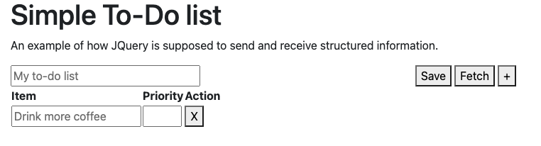
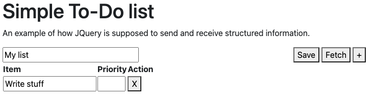
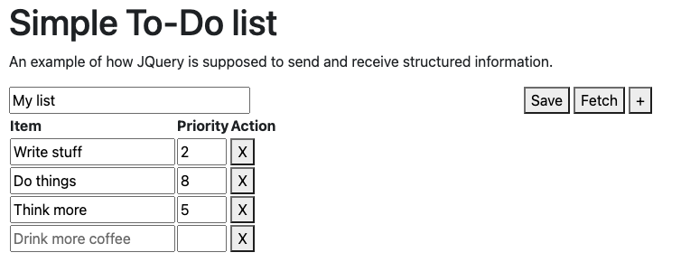
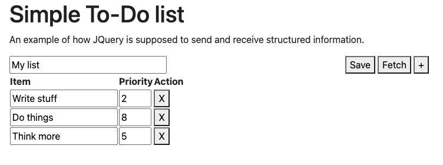

# Minimal web-based todo list with a RESTful API

This is based on the previous example, [TodoListApp](https://github.com/UO-CIS322/TodoListApp).

It was literally written in the afternoon lab held on March 3rd 2023, so please watch that first if you have questions.

## Getting started

Copy `.env-example` into `.env` (see Lab recording for details.)

As long as you have Docker and compose set up, just do:

```
docker compose up
```

The default port for the client service is `5002`, and `5001` for the API.
You can modify it in `docker-compose.yml` or set up an override file.

### API

One resource: `todolists`:

```
/api/todolists
```

#### GET request
Returns all to-do lists stored in the database.

#### POST request
Expects a JSON input with keys `title` and `items`, where `title` is a string, and `items` is a list of dictionaries with keys
`description` and `priority`.

Inserts input list into the database, returns primary key.

### Web service
Just go to `localhost:5002` (if you're not running docker locally, replace `localhost` with the correct hostname, if you're not
binding to port `5005`, replace that as well.)

You should see a webpage that looks like the following:




Click the :heavy_plus_sign: button to add items to the list.
Then enter any value.



And upon clicking "Save", jQuery will send a POST request to `/insert`, which takes in the list,
inserts it into the database (MongoDB; database: todo ; collection: lists).
Empty list items will be ignored.



If you go ahead and refresh, you should get an empty list again:


Upon clicking "Fetch", jQuery will send a *GET* request to `/fetch` with no data, and gets back the _newest_
entry in the database, and populates the page with it.



### Database
We're using MongoDB (v 5.0.5), just like project 5.


## What's this for?
This example has Javascript for loops, sends POST requests with variable length data (in JSON) sent to the backend, and sends
GET requests to fetch said data back from the server, and populates the HTML with it.

Despite its simplicity, it has a few bells and whistles that you WON'T use in project 5, such as the :heavy_plus_sign: and
:heavy_multiplication_x: buttons. You'll stick to the fixed 20 rows there.

But what you can do is to look at the HTML, Javascript (both in one HTML file) and Flask and how they interact, and use that to
finish your [project 5](https://github.com/UO-CIS322/project-5).


## Authors
Created by [Ali Hassani](https://alihassanijr.com) for [CS 322](https://classes.cs.uoregon.edu/23W/cis322/).
